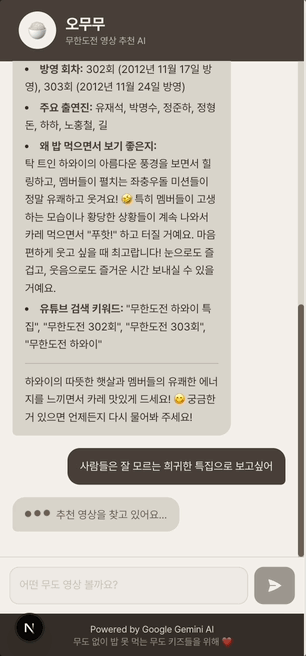

# 오무무 (Omumu) 🍚📺

오늘 무한도전 뭐 보지?
밥 먹으면서 볼 무한도전 유튜브 영상을 AI가 추천해주는 서비스입니다.



## 기술 스택

- **Framework**: Next.js 15 (App Router)
- **Language**: TypeScript
- **Styling**: TailwindCSS
- **Font**: Pretendard (프리텐다드)
- **AI**: Google Gemini 1.5 Flash

## 시작하기

### 1. 의존성 설치

```bash
npm install
```

### 2. 환경 변수 설정

프로젝트 루트에 `.env.local` 파일을 생성하고 Gemini API 키를 입력하세요:

```bash
GEMINI_API_KEY=your_gemini_api_key_here
```

> 💡 Gemini API 키는 [Google AI Studio](https://aistudio.google.com/app/apikey)에서 무료로 발급받을 수 있습니다.

### 3. 개발 서버 실행

```bash
npm run dev
```

[http://localhost:3000](http://localhost:3000)에서 확인하세요.

## 주요 기능

- 🤖 **AI 기반 추천**: Gemini AI가 사용자의 요청에 맞는 무한도전 영상을 추천
- 💬 **대화형 인터페이스**: 자연스러운 채팅 방식으로 영상 추천 요청
- 📱 **반응형 디자인**: 모바일, 태블릿, 데스크톱 모두 지원
- 🎨 **세련된 UI**: 잿빛 아이보리와 다크 브라운 컬러 테마

## 사용 예시

- "유재석이 나오는 웃긴 영상 추천해줘"
- "감동적인 무한도전 에피소드 알려줘"
- "무도 가요제 중에 제일 재밌는 거 추천해줘"
- "짧게 볼 수 있는 무도 클립 추천해줘"

## 프로젝트 구조

```
omuomu-next-ts/
├── src/
│   ├── app/
│   │   ├── api/chat/route.ts    # Gemini API 엔드포인트
│   │   ├── globals.css          # 테마 및 폰트 설정
│   │   ├── layout.tsx           # 루트 레이아웃
│   │   └── page.tsx             # 메인 페이지
│   ├── components/
│   │   ├── Chatbot.tsx          # 챗봇 메인 컴포넌트
│   │   ├── ChatInput.tsx        # 입력 컴포넌트
│   │   └── ChatMessage.tsx      # 메시지 컴포넌트
│   └── lib/
│       └── gemini.ts            # Gemini API 설정
└── .env.local                   # 환경 변수 (API 키 설정 필요)
```

## 커밋 메시지 컨벤션

프로젝트의 커밋 히스토리를 일관되게 유지하기 위해 아래의 컨벤션을 따릅니다. 한국어로 작성하되, 제목은 영어 타입(선택) 또는 한글을 사용해도 무방합니다. 핵심은 형식의 일관성입니다.

- 형식: `<type>(<scope>): <subject>`
  - `type`: 아래 표 참조
  - `scope`(선택): 변경 대상(예: `chat`, `api`, `layout`)
  - `subject`: 간결한 변경 요약(명령형, 50자 이내 권장)

아래 표는 `type`에 대한 상세 설명입니다. 각 타입의 사용 시점과 간단한 예시를 함께 제공합니다.

| Type     | 설명                                                      | 사용 시점                                    | 예시                                           |
| -------- | --------------------------------------------------------- | -------------------------------------------- | ---------------------------------------------- |
| feat     | 새로운 기능 추가                                          | 사용자에게 보이는 기능을 새로 추가할 때      | `feat(chat): add ChatInput component`          |
| fix      | 버그 수정                                                 | 동작이 잘못되거나 오류를 수정할 때           | `fix(api): validate request body in /api/chat` |
| docs     | 문서 관련 변경                                            | README, 주석, 문서 업데이트만 있을 때        | `docs: update README with setup steps`         |
| style    | 코드 포맷팅·공백·세미콜론 등 스타일 변경 (로직 변경 없음) | 코드 동작에는 영향이 없고 스타일만 변경할 때 | `style: format code with prettier`             |
| refactor | 코드 리팩터링(동작 변경 없음)                             | 버그 수정/기능 추가 없이 구조 개선할 때      | `refactor(lib): extract gemini client`         |
| perf     | 성능 개선                                                 | 속도/메모리 등 성능이 향상될 때              | `perf(cache): improve response caching`        |
| test     | 테스트 추가/수정                                          | 단위/통합/e2e 테스트를 추가하거나 수정할 때  | `test(api): add unit tests for chat route`     |
| chore    | 빌드 업무/패키지 업데이트/잡무                            | 코드 변경(기능/버그/테스트)이 아닌 작업      | `chore(deps): upgrade eslint`                  |
| ci       | CI 설정 변경                                              | GitHub Actions 등 CI 설정을 변경할 때        | `ci(github): add commitlint check`             |

- 바디(선택): 필요 시 변경 이유와 구현 상세를 한두 문단으로 설명합니다. 문장은 현재형/명령형으로 작성합니다.

- 푸터(선택): `BREAKING CHANGE:` 또는 이슈 번호(`#123`)를 명시합니다.

예시:

```
feat(chat): add ChatInput component for user messages

- 채팅 입력 컴포넌트 추가
- Enter 키로 전송, 빈 메시지 방지 로직 포함

Refs: #42
```

```
fix(api): validate request body in /api/chat route

- 클라이언트에서 오는 빈 메시지/잘못된 형식 처리 추가
```

권장 추가 도구:

- 로컬에서 커밋 메시지 규칙을 강제하려면 `commitlint` + `husky`를 사용하세요.
- 사용자 편의를 위해 `commitizen`을 도입할 수 있습니다.

### Commitizen 사용 예시

Commitizen을 사용하면 인터랙티브한 질문을 통해 규칙에 맞는 커밋 메시지를 쉽게 만들 수 있습니다. 간단한 사용 흐름과 생성 예시는 아래와 같습니다.

1. 실행

```bash
npm run commit
# 또는
npx cz
```

2. 질문 예시

- `type` 선택: feat
- `scope` 입력: chat
- `subject` 입력: add ChatInput component
- `body` 입력: Enter 키 전송과 빈 메시지 방지 로직 구현
- `footer` 입력(선택): Refs: #42

3. Commitizen이 생성하는 최종 커밋 메시지 예시

```
feat(chat): add ChatInput component

- Enter 키 전송과 빈 메시지 방지 로직 구현

Refs: #42
```

4. 훅 검증

생성된 메시지는 `.husky/commit-msg` 훅에서 `commitlint`로 검증됩니다. 규칙 위반 시 커밋이 차단되며 메시지를 수정하고 다시 시도하세요.

## 컬러 팔레트

| 색상        | Hex       | 용도              |
| ----------- | --------- | ----------------- |
| Ivory       | `#E8E4DE` | 메인 배경         |
| Ivory Light | `#F2F0EB` | 밝은 배경         |
| Ivory Dark  | `#D9D4CC` | 테두리, 음영      |
| Brown       | `#4A4039` | 메인 텍스트, 버튼 |
| Brown Light | `#6B5D52` | 보조 텍스트       |
| Brown Dark  | `#352E28` | 강조, 푸터        |
